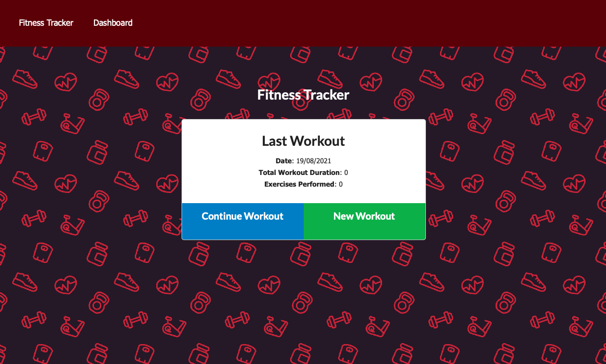
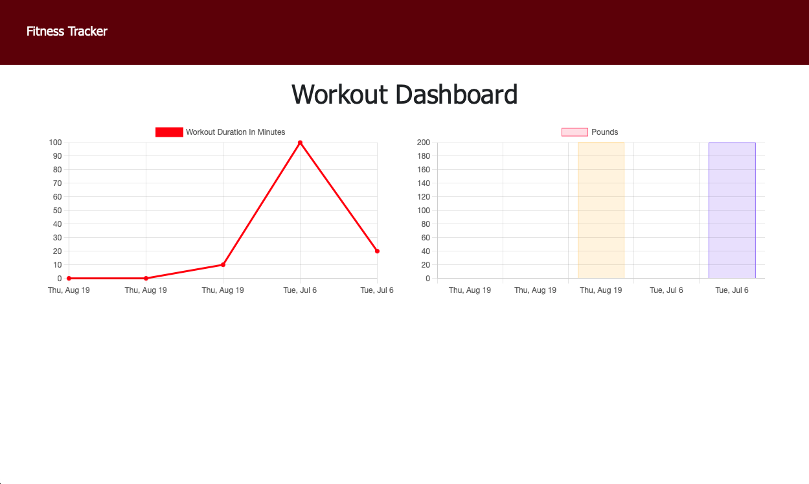

# the-fitness-tracker

  ## Description
A purpose built fitness tracking app that allows you to record and monitor numerous exercises. Users are able to upload excerices name, weights, reps, distance and duration. These can be viewed on stats page.

The front-end of the app has been built using HTML, CSS and Javascript. While the backend of the app uses node.js, express, Mongoose and Mongodb to store data.

It has been deployed on Heroku, with the assistance of MongoDB Atlas.

  ## Contents Table
  - [Installation](#Installation)
  - [Usage](#Usage)
  - [ScreenShot](#Screenshot)
  - [Collaborators](#Collaborators)
  - [License](#License)
  - [Author](#Author)

## Installation

The app works in most browsers and is deployed on [Heroku](https://the-fitnesstracker.herokuapp.com).

To install the app, clone the repo from GitHub, open in VS Code and open the terminal:

* step 1 `npm init`
* step 2 `npm install`
* Ensure all dependencies and dev dependencies (express, mongoose, morgan) are installed if you encounter errors (npm install {package}).
* Enter 'node seed/seeds.js' to seed data.

## Usage
Once relevant NPM packages are installed, enter npm run start. this will start the app on port number mention in the server.js file.

## Screenshot

## Collaborators
none

## License
- 
- [MIT OPEN SOURCE](https://opensource.org/licenses/MIT)

## Author
- Wael Ahmed
- Find the repo for this on: https://github.com/wa20/the-fitness-tracker
- Find app deployment on: https://the-fitnesstracker.herokuapp.com

